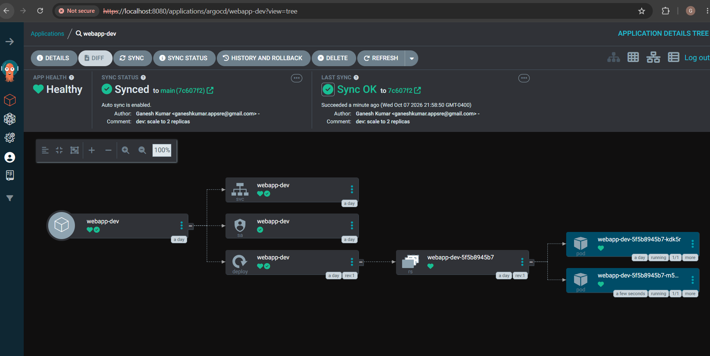
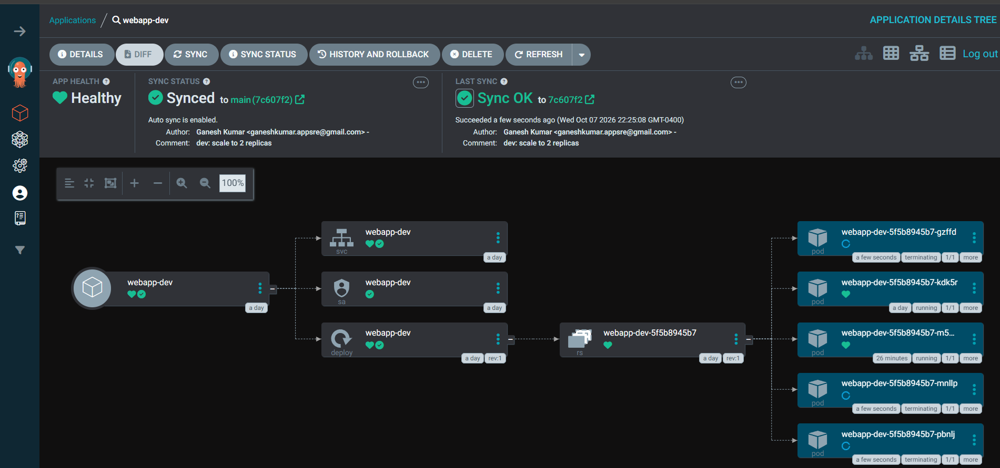
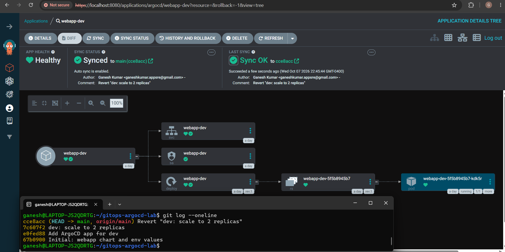
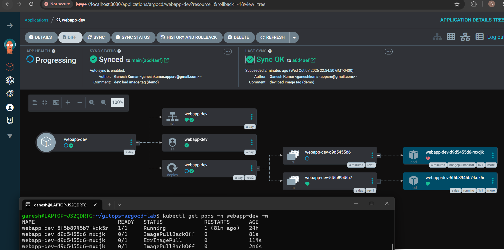
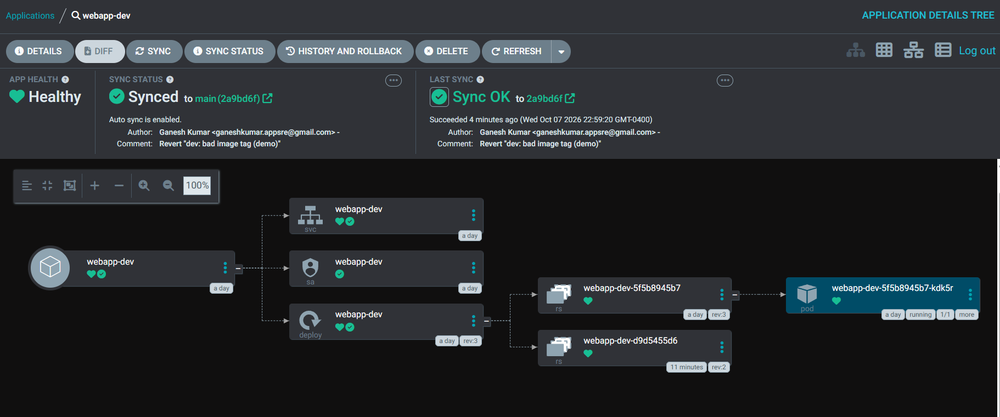
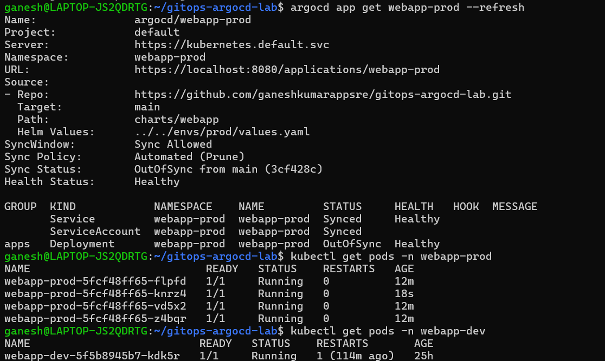
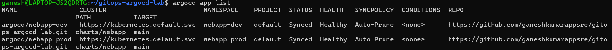
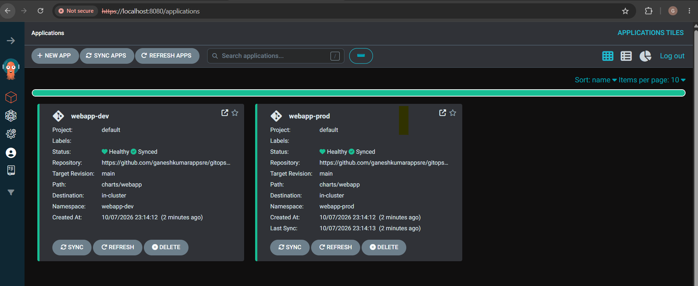

# GitOps with ArgoCD on Kubernetes (kind)

Git is the single source of truth: ArgoCD deploys a Helm chart to dev and prod
namespaces, auto-syncs changes, reverts manual drift, and rolls back via `git revert`.

**Stack:** kind (Kubernetes v1.37) · ArgoCD v3.5 · Helm v3.22 · ApplicationSet · GitHub
**Cost:** $0 (runs locally)

## Architecture
GitHub repo (main) → ArgoCD (pull-based, polls ~3 min) → kind cluster
→ namespaces `webapp-dev` (1 replica) and `webapp-prod` (3 replicas)

## Repo structure
```
charts/webapp/            Helm chart (from my k8s-helm-eks project)
envs/dev|prod/values.yaml Per-environment overrides
argocd/applicationset.yaml  One template generating webapp-dev and webapp-prod
docs/                     Screenshots
```

## Reproduce
```bash
kind create cluster --name gitops-lab
kubectl create namespace argocd
kubectl apply -n argocd --server-side --force-conflicts \
  -f https://raw.githubusercontent.com/argoproj/argo-cd/stable/manifests/install.yaml
kubectl apply -f argocd/applicationset.yaml
```

## What I demonstrated
| # | Scenario | Result | Evidence |
|---|----------|--------|----------|
| A | Change replicas via Git commit | Auto-synced, 1 → 2 pods |  |
| B | `kubectl scale` to 5 (manual drift) | Self-heal reverted in ~2s |  |
| C | Rollback with `git revert` | Cluster returned to prior state, full audit trail |  |
| D | Bad image tag pushed | New pod ImagePullBackOff, old pod kept serving (no outage); fixed via revert |     |
| E | Change prod only | Prod 3 → 4 pods, dev untouched |  |
| F | Delete a template from Git | ArgoCD pruned the resource |  |



## Lessons learned
- **Synced ≠ Healthy:** during the bad deploy, ArgoCD showed Synced (cluster matches Git)
  while Health was Progressing (pod couldn't start).
- **Rollback is a Git operation:** `argocd app rollback` is disabled while auto-sync is on.
- **ApplicationSet CRDs need `--server-side` apply** (client-side hits the annotation size limit).
- **Rolling updates protect users:** the old ReplicaSet kept serving until the new one was ready.
- Polling is ~3 min by default; I used `argocd app get --refresh` to speed up demos.

## What I'd change for production
- Private repo credentials / deploy keys, SSO + RBAC instead of the admin user
- AppProjects to restrict destinations and sources
- Webhooks instead of polling; Argo Rollouts for canary/blue-green
- External Secrets or Sealed Secrets for sensitive values
- Separate clusters per environment (here both share one kind cluster)
